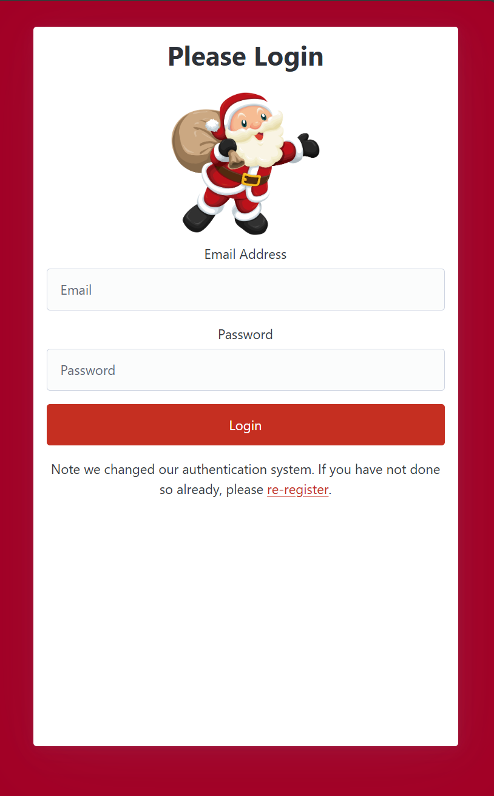
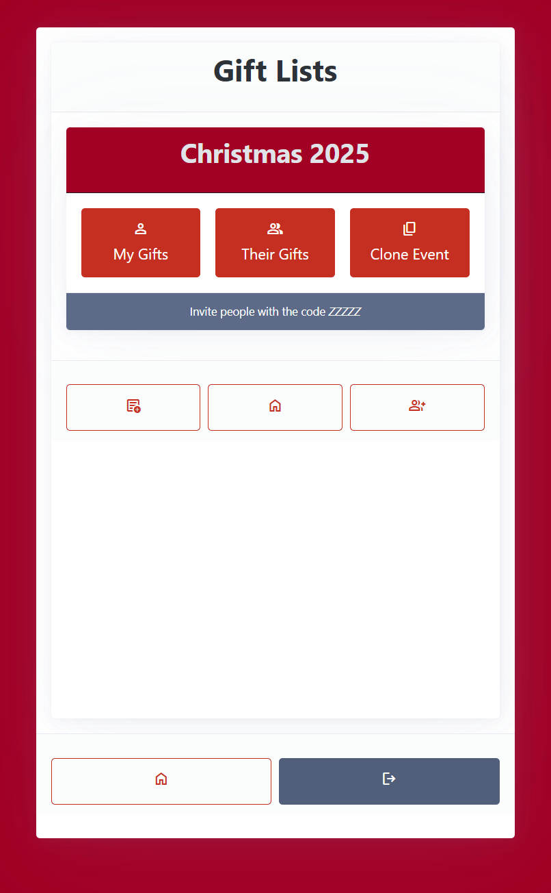
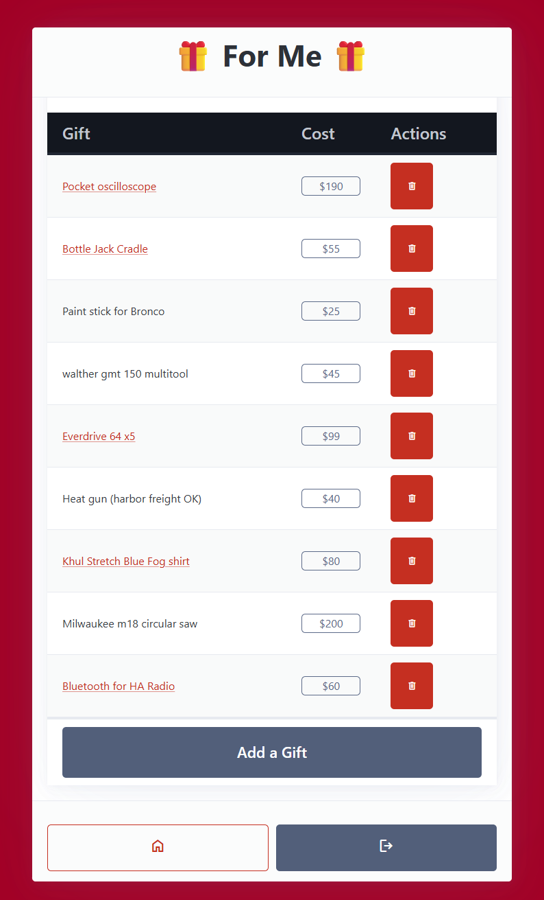

# Santa's Little Helper
 
Simple app built on MongoDB Realm and Blazor to allow a group of users to enter gifts they want for Christmas, then have others view those gifts and mark off if it was already purchased without letting the recipient know it was bought.

## Features

* Username/password authentication (Realm)
* User can view their list and add new items with a title and link
* Users can view everyone else's list and mark off if they bought that item off the list
* Other users can see something was snagged for purchase (to prevent double buys) but doesn't know who
* The recipient of that gift cannot see whether items were bought off their list

## Missing features

_Possibly being checked off on future releases_

* Removing item off your list or rename it
* List codes or groups to allow for multi-tenancy 
* Password reset
* User registration (done via Realm admin portal today)

## Screenshots

